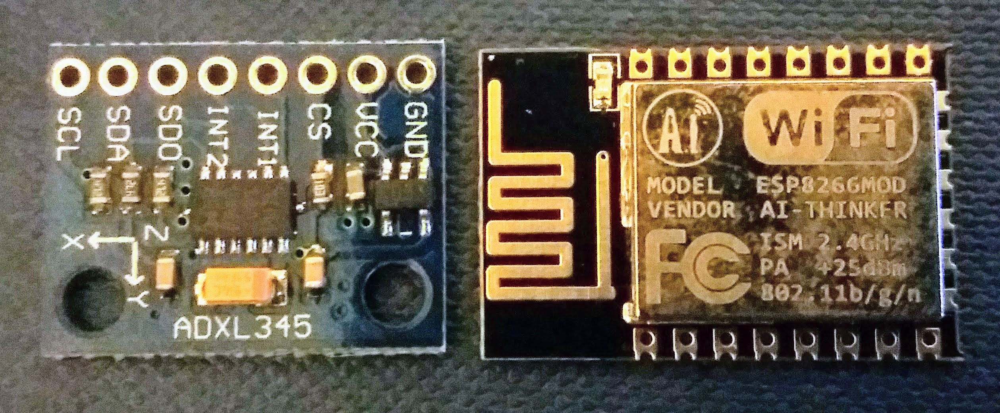
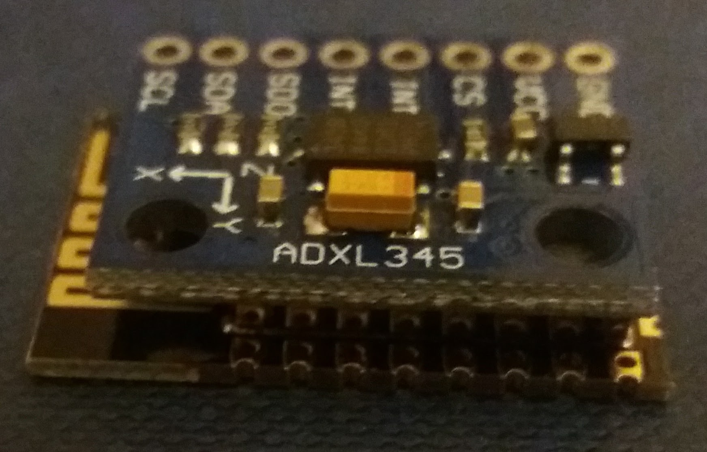

# Seizure Detector Watch using DIY Hardware

A version of the OpenSeizureDetector Pebble Watch App that runs on an ESP8266 wifi module.

# The Plan
*  Use a very small ESP8226 module
*  Connect an ADXL345 accelerometer using i2c interface
*  Power it from a LiPo battery
*  Use a 3D printed case to make it into a watch  
*  Software will use the FreeRTOS ESP8266 SDK so it can be ported to other platforms more easily in the future.
*  Initially it will provide a web server to act as an OpenSeizureDetector 'Network Datasource' (this is likely to be too power hungry so I think we will change it to push data over wifi rather than wait for clients to ask for it in the future).

# Hardware Parts
## Development Version
* ESP8226 board, with on-board USB for debugging (http://www.ebay.co.uk/itm/322463251729?_trksid=p2060353.m2749.l2649&ssPageName=STRK%3AMEBIDX%3AIT) (£5.80)
* ADXL345 module (http://www.ebay.co.uk/itm/142166117195?_trksid=p2060353.m2749.l2649&ssPageName=STRK%3AMEBIDX%3AIT) (£2.82)

## Prototype Version
* Small ESP8266 Board - ESP-12F (http://www.ebay.co.uk/itm/282412004710?_trksid=p2060353.m2749.l2649&ssPageName=STRK%3AMEBIDX%3AIT) (£2.52)
* ADXL345 Individual IC (http://www.ebay.co.uk/itm/132189086693?_trksid=p2060353.m2749.l2649&ssPageName=STRK%3AMEBIDX%3AIT) (£1.35)
* LiPo Battery (don't know which yet)

# Hardware Connections
## Connect ADXL345 accelerometer to ESP8226
*  SDA - GPIO2
*  SDL - GPIO4
*  3.3V
*  GND

# Software
## Software Structure
*  Use ESP8266 RTOS SDK.
*  Base ADXL interface code on (https://gist.github.com/shunkino/6b1734ee892fe2efbd12)
*  Still a lot to do to get it to a proof-of-concept.....

## Building 
*  Build the toolchain as a standalone toolchain from (https://github.com/pfalcon/esp-open-sdk)
*  Download the RTOS SDK for ESP8266 (https://github.com/espressif/ESP8266_RTOS_SDK)
*  Build using
  *  cd osd_app
  *  source ../set_paths.sh
  *  ./gen_misc.sh (accept default values)
  *  ../flash_image.sh
  *  ../monitor.py (to view debugging information over serial (USB) interface)
  
  
*  
