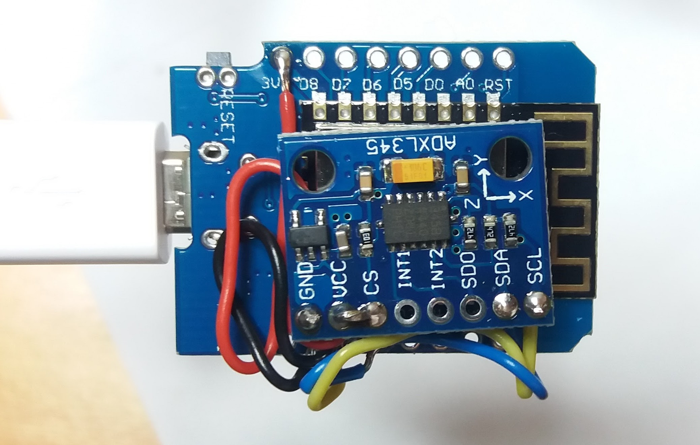

# Seizure Detector Watch using DIY Hardware

A version of OpenSeizureDetector that runs on an ESP8266 wifi module.

# The Plan
*  Use a very small ESP8226 module
*  Connect an ADXL345 accelerometer using i2c interface
*  Power it from a LiPo battery
*  Use a 3D printed case to make it into a watch  
*  Software will use the esp-open-rtos FreeRTOS based ESP8266 SDK so it can be ported to other platforms more easily in the future (https://github.com/SuperHouse/esp-open-rtos).
*  Initially it will provide a web server to act as an OpenSeizureDetector 'Network Datasource' (this is likely to be too power hungry so I think we will change it to push data over wifi rather than wait for clients to ask for it in the future).

# Hardware Parts
## Feasibility and Proof-of-Concept Version
* Wemos D1 Mini ESP8226 board, with on-board USB for debugging (http://www.ebay.co.uk/itm/322463251729?_trksid=p2060353.m2749.l2649&ssPageName=STRK%3AMEBIDX%3AIT) (£5.80)
* ADXL345 module (http://www.ebay.co.uk/itm/142166117195?_trksid=p2060353.m2749.l2649&ssPageName=STRK%3AMEBIDX%3AIT) (£2.82)

## Prototype Version
* Small ESP8266 Board - ESP-12F (http://www.ebay.co.uk/itm/282412004710?_trksid=p2060353.m2749.l2649&ssPageName=STRK%3AMEBIDX%3AIT) (£2.52)
* ADXL345 Individual IC (http://www.ebay.co.uk/itm/132189086693?_trksid=p2060353.m2749.l2649&ssPageName=STRK%3AMEBIDX%3AIT) (£1.35)
* LiPo Battery (don't know which yet)

# Hardware Connections
## Connect ADXL345 accelerometer to ESP8226
*  SCL  - GPIO5  (D1 on Wemos D1 Mini module)
*  SDA  - GPIO4  (D2 on Wemos D1 Mini module)
*  INT1 - GPIO13 (D7 on Wemos D1 Mini module)
*  3.3V
*  GND

No external resistors etc. are necessary.

# Development Plan
## Fesibility Study
*  Use esp-open-rtos Software Development Kit (https://github.com/SuperHouse/esp-open-rtos).
*  Use the i2c library included in the SDK.
*  Port the Arduino ADXL345 library to C and convert to use the i2c library (Complete).
*  Extend the ADXL345 library to use the FIFO register in the ADXL345 so we
   receive data in batches to save power (Complete)
*  Port the OpenSeizureDetector Pebble_SD code to use the new library, and send output to serial port for debugging (complete)
*  Add web server to prove ESP8266 capable of running seizure detector and networking simultaneously.

## Proof-of-Concept
*  Make web server act as an OpenSeizureDetector Network DataSource (in progress)
*  Test battery consumption
*  Optimise code to make battery power feasible (may involve changing from web server to ESP8266 sending data to OpenSeizureDetector alarm system)
*  Select rechargeable battery.

## Prototype
*  Make programmer hardware for ESP-12F module
*  Hand wire ADXL345 chip to ESP-12F module  
*  Connect battery
*  Design and build battery charging hardware.
*  Test
*  Produce 3D printed watch case.

# Instructions
Note that this is just at proof-of-concpt stage - don't expect it to
produce a working seizure detector!

*  Install the esp-open-rtos SDK using the instructions at https://github.com/SuperHouse/esp-open-rtos
*  Compile using
  *  cd osd_app
  *  make html  (prepare test data for web server)
  *  make  (compile software)
  *  make flash (to programme ESP8266 connected via USB)
  *  ../monitor.py (to view debugging information over serial (USB) interface).
  *  Press the reset button on the ESP8266 to view boot up and initialisation debugging information.

# Debugging
If the ESP8266 crashes because of a software bug (Such as divide by zero),
debugging information is written to the USB serial line that you can see
using monitor.py

You can find information on interpreting the crash dump at https://github.com/SuperHouse/esp-open-rtos/wiki/Crash-Dumps.

